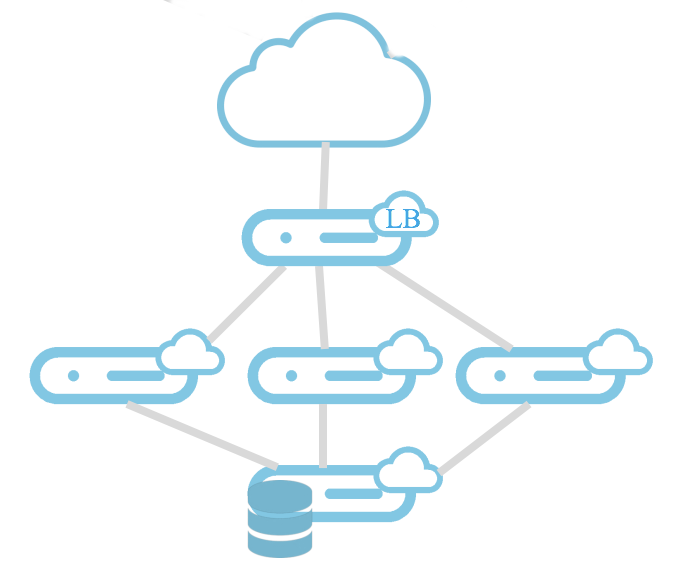

We'll use an orchestration tool called Terraform. This open source tool from Hashicorp is often used to manage cloud infrastructures. It has an OpenStack driver offering the possibility to speak directly to the APIs and stay standard.

# Target Infrastructure

We have a backend server with NFS and MySQL to serve data to the 3 frontwebs. In front of the frontwebs, we have a load balancer routing the HTTP requests to the frontwebs.



# Exercise

In this exercise we'll see how Terraform works and what its syntax is. We'll also use cloud-init to configure operating systems and add the load balancing capability.

You have some files missing parts and you'll have to complete them. Those parts are **in bold** in the following text and some explanations are given to help you complete it and make it working. Take time to look how each sections of the files are built.

## main.tf

This is the orchestration for the whole environment in Terraform syntax. The main instructions are in "app" module, called from here.

This file contains, in order:

  * An OpenStack provider taking its configuration from environment variables
  * **A keypair resource**
    * This is one of the simplest resources, it creates an OpenStack keypair by pushing your user's public key
    * Add those lines between provider "openstack" and module "app"
      ```
      resource "openstack_compute_keypair_v2" "gw" {
        name = "gw"
        public_key = "${file("~/.ssh/id_rsa.pub")}"
      }
      ```
  * A module "app"
    * The source code is outside of our 1.test folder to be shared with other potential environments when it's needed
    * Some variables are defined

> If in doubt, you can have a look at the file main.tf
>
> If you are really lost, just copy the .main.tf to main.tf
> ```bash
> cp .main.tf main.tf
> ```


## The app module

Here we'll see some more advanced usages of Terraform. We'll reuse the cloud-init files we have in 0.dev and we'll add the load balancer subscription to the frontweb.yaml. We need the same SSH key mechanism that we had in the stress module but we can do it in a nicer way.

### ../terraform-modules/app/main.tf

This is the app resources orchestration. This is the occasion to see how Terraform templates can help us write nice "Infrastructure as Code".

This file contains, in order:

  * Some variables
  * A private network
  * A subnet
  * A SSH key generation
  * A template file to generate the frontweb cloud-init file
    * This section will take the frontweb.yaml file as a template
    * **In this template, we will replace the variable ssh_shared_priv_key with the indented private key certificate**
      * Add those lines
        ```
          vars {
            ssh_shared_priv_key = "${indent(7, tls_private_key.shared_ssh_key.private_key_pem)}"
          }
        ```
  * A template file to generate the loadbalancer cloud-init file
    * It's almost the same thing. Here it's the public key part and there is no indentation
  * A backend instance
    * Some definitions
    * An Ext-Net definition
    * **A privatenet-test definition with a fixed IP**
      * Add those lines
        ```
          network {
            name        = "${openstack_networking_network_v2.privatenet-test.name}"
            fixed_ip_v4 = "10.1.254.254"
          }
        ```
    * A user_data definition
  * A loadbalancer instance
    * Some definitions
    * An Ext-Net definition
    * **A user_data definition**
      * Here is where we'll use our generated data from the template
      * Add this line
        ```
          user_data = "${data.template_file.lb_userdata.rendered}"
        ```
  * A frontweb instance
    * You already known all those definition ;)
    * Just have a look at the dependencies, the count variable and the meta-data definition to keep in mind how it works

> If in doubt, you can have a look at the file .main.tf
>
> If you are really lost, just copy the .main.tf to main.tf
> ```bash
> cp ../terraform-modules/app/.main.tf ../terraform-modules/app/main.tf
> ```

### ../terraform-modules/app/loadbalancer.yaml

A cloud-init file with cloud-config syntax to setup the loadbalancer server.

This file contains, in order:

  * **A user definition**
    * We need the default user
    * We also need a root user defined with the previously generated public key in the authorized SSH keys
    * We'll use our ssh_shared_pub_key variable defined to generate the template
    * Add those lines at the beginning
      ```
      users:
        - default
        - name: root
          ssh-authorized-keys:
            - ${ssh_shared_pub_key}
      ```
  * An apt update
  * Some packages installation
  * A write_file section
  * A runcmd section

> If in doubt, you can have a look at the file .loadbalancer..yaml
>
> If you are really lost, just copy the .loadbalancer..yaml to loadbalancer.yaml
> ```bash
> cp ../terraform-modules/app/.loadbalancer.yaml ../terraform-modules/app/loadbalancer.yaml
> ```

### ../terraform-modules/app/frontweb.yaml

A cloud-init file with cloud-config syntax to setup the frontweb servers.

This file contains, in order:

  * A bootcmd section
  * A mount section
  * An apt update
  * Some packages installation
  * A write_file section
    * **A /root/.ssh/id_rsa file**
      * The content will be provided by the SSH private part variable in the template
      * Add those lines:
        ```
         - content: |
               ${ssh_shared_priv_key}
           path: /root/.ssh/id_rsa
           owner: root:root
           permissions: '0600'
        ```
    * Some other files to setup systemd
  * A runcmd section

> If in doubt, you can have a look at the file .frontweb..yaml
>
> If you are really lost, just copy the .frontweb..yaml to frontweb.yaml
> ```bash
> cp ../terraform-modules/app/.frontweb.yaml ../terraform-modules/app/frontweb.yaml
> ```

### ../terraform-modules/app/backend.yaml

A cloud-init file with cloud-config syntax to setup the backend server.

Nothing is really new here.

### Use Terraform to boot the app infrastructure

Again, we'll see in advance what Terraform plans to do.
```bash
terraform plan -target openstack_compute_keypair_v2.gw -target module.app
```

Then run it!
```bash
terraform apply -target openstack_compute_keypair_v2.gw -target module.app
```

And voilà! Your app is deployed. You can test it by putting the IP address of the loadbalancer in your browser. Reminder how to get the list and IPs of your servers with the CLI:
```
openstack server list
```

## Kill them all

It's time to delete your resources.

```bash
terraform destroy
```

You can confirm and see the magic happening.
