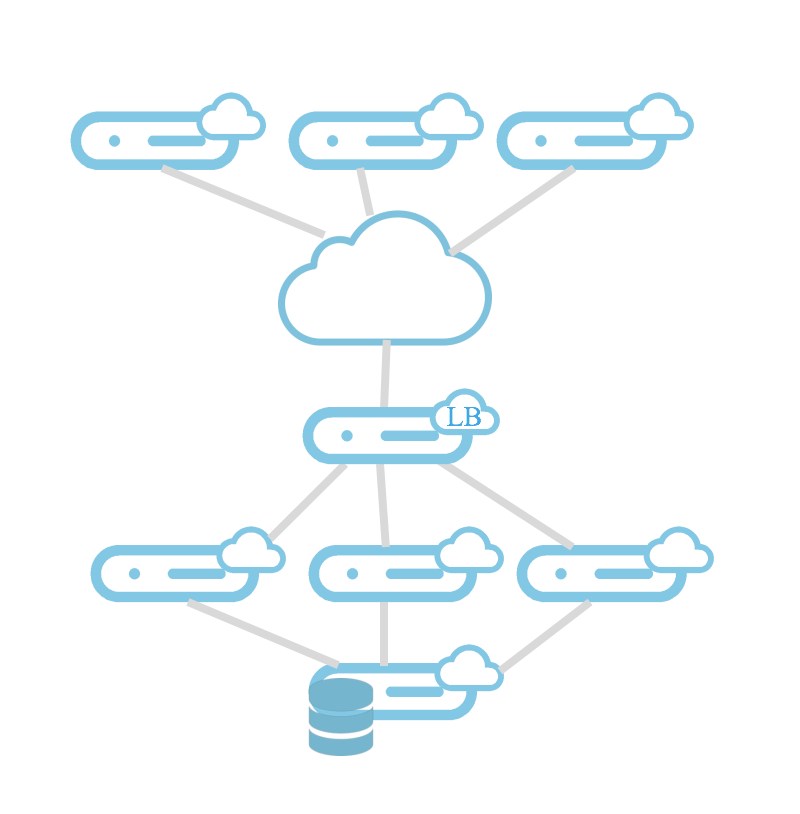

This is an "Infrastructure as Code" workshop using:
* [cloud-init](https://cloudinit.readthedocs.io/en/latest/): a configurable boot script manager for cloud instance
* [Terraform](https://www.terraform.io/): a IaaS orchestrator from Hashicorp
* [OVH Public Cloud](http://www.ovh.com/public-cloud/): a IaaS/PaaS solution based on OpenStack (and more) by OVH

# Purpose

You'll run a workshop which present you some **"Infrastructure as Code"** basics. IaC is the art of deploying and managing IT resources using programs and definition files in order to automatize and benefit from all the best practices in the development process like patching, templating, versioning and many others.

You'll use an environment which shows how to use Terraform, an orchestrator tool. You'll manipulate some resources, modules and template definitions with dependences

Broadly speaking, the workshop presents files with missing parts and you'll have to complete its with copy/paste actions. Of course, the interest for you is to pay attention on the code structure and best practices to understand the possibilities you have with IaC.

## Schema



# Requirements

To start the workshop, you'll need an OVH Account, a new public cloud project with enabled private networks.

## Workshop introduce with an OVH people

All requirements have been prepared for you. A server is available with the proper environment.

```bash
ssh bounce@xxx.xxx.xxx.xxx
source credentials
```

The IP and the password are provided during the workshop. You have to give a unique ID, it can be your desktop ID or your firstname.name (without accent and space). In case of connection lost, just redo the same.

## Self-service workshop

### Create your OVH account and your Public Cloud project

You can skip this section if you already have one but be sure to be able to run a workshop on it (your company could have some restrictions about that if you plane to use your company's account).

If you run this workshop online and you don't have an account, just [sign up](https://www.ovh.com/public-cloud/) and log in to the web console.

### Private networks

Once your public cloud project is ready, click on "Private Network" on the left menu bar and create a vRack. After few minutes, private networks are activated.

### An OpenStack User

On the left menu bar, go to "Users and Roles", then on "Create a User". Give a description and choose "Administrator" for the role. 

Now we'll get the configuration file for this user. Click on the small tool icon on the right side of the user line, then on "Download the OpenStack configuration file". Keep the text editor open, we'll copy/paste the content of this file.

Create a file in your environment named credentials and paste the content of the downloaded file on the previous step.

### Install Terraform

(TODO) install terraform on your environment.

# Let's Go!

```bash
git clone https://github.com/pilgrimstack/workshop-301-light.git
cd workshop-301-light/1.test
```

Let's go to the [terraform environment](./1.test).
